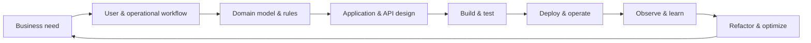

# EPOS — Enterprise Platform OS

> Designing and engineering a modern bank from the ground up.

EPOS is a long-term engineering program to design, build, and operate the products and technology capabilities of an enterprise bank. It spans customer and party management, deposits, lending, accounts, payments, cards, foreign exchange, trade finance, risk, compliance, channels, data, security, infrastructure, and operations.

The objective is not only to produce working banking software. EPOS is a practical environment for learning, challenging decisions, improving designs, refactoring safely, and continuously optimizing a large enterprise platform while applying real-world architecture and engineering principles.

## At a glance

|                   |                                                                                          |
| ----------------- | ---------------------------------------------------------------------------------------- |
| **Mission**       | Engineer banking products and their supporting platform from first principles            |
| **Approach**      | Product-led, domain-driven, backend-first, and end-to-end by design                      |
| **Architecture**  | Modular monorepo with strict Domain, Application, Infrastructure, and API boundaries     |
| **Delivery**      | Incremental releases, vertical slices, automated quality gates, and documented decisions |
| **Current focus** | Release 1.0 — Enterprise Foundation · Phase 2 — Application Layer                        |

## One program, the whole bank

```mermaid
flowchart TB
    EPOS["EPOS<br/>Enterprise Banking Platform"]

    EPOS --> REL["Customers & Relationships"]
    EPOS --> CORE["Core Banking"]
    EPOS --> MOVE["Movement of Money"]
    EPOS --> ENT["Enterprise Banking"]
    EPOS --> CTRL["Control Functions"]
    EPOS --> TECH["Technology & Operations"]

    REL --> PARTY["Party & Customer"]
    REL --> CHANNELS["Web, Mobile, Branch & Partner Channels"]

    CORE --> PRODUCTS["Deposits, Lending & Credit"]
    CORE --> ACCOUNTS["Agreements, Accounts & Ledger"]

    MOVE --> PAYMENTS["Payments, Clearing & Settlement"]
    MOVE --> CARDS["Cards & Transaction Processing"]

    ENT --> FX["Foreign Exchange & Treasury"]
    ENT --> TRADE["Trade Finance"]

    CTRL --> RISK["Risk, Fraud & Compliance"]
    CTRL --> AUDIT["Audit, Reporting & Governance"]

    TECH --> PLATFORM["Cloud, Kubernetes, Data & Events"]
    TECH --> OPS["Security, Observability, Reliability & AI"]
```



Every capability is designed as part of one connected banking ecosystem rather than as an isolated technical exercise.

## How EPOS is engineered



This lifecycle keeps product thinking, architecture, implementation, and operations connected. Working software provides evidence; that evidence is used to improve the model and the platform.

## Architecture principles

- **Business capability driven** — Organize the platform around banking capabilities, not technologies.
- **Domain ownership** — Keep business rules inside explicit bounded contexts and aggregate boundaries.
- **Separation of concerns** — Prevent APIs, databases, messaging, and infrastructure from owning business behavior.
- **API and event ready** — Design application services for reuse by APIs, jobs, workflows, and event consumers.
- **Security and observability by design** — Treat controls and operational visibility as foundational capabilities.
- **Evolution over perfection** — Build incrementally, measure outcomes, refactor intentionally, and document major decisions.
- **Automation first** — Use repeatable builds, tests, quality gates, delivery pipelines, and infrastructure automation.
- **Documentation as an asset** — Keep architecture, decisions, risks, dependencies, and delivery history traceable.

### Layered model

```text
API / Jobs / Events
        ↓
Application Layer       Commands · Queries · Use Cases · DTOs
        ↓
Domain Layer            Entities · Value Objects · Business Rules
        ↑
Infrastructure          Persistence · Messaging · Caching · Integrations
```

Dependencies point toward business behavior. Domain code remains independent of Express, PostgreSQL, Kafka, Redis, and cloud-provider SDKs.

## Current progress

| Phase                                   | Outcome                                                                    | Status |
| --------------------------------------- | -------------------------------------------------------------------------- | :----: |
| **-1 — Technology & Platform Baseline** | Architecture, engineering standards, monorepo, toolchain, and governance   |   ✅   |
| **0 — Engineering Foundation**          | Runnable System API, TypeScript, testing, logging, Docker, and CI          |   ✅   |
| **1 — Enterprise Domain**               | Party Management, Customer, Product, Agreement, Account, and Ledger models |   ✅   |
| **2 — Application Layer**               | Commands, queries, DTOs, repositories, and application use cases           |   🟢   |

Current Application Layer capabilities include registering, retrieving, activating, deactivating, and renaming a Party. Customer, Product, Agreement, Account, and Ledger workflows follow incrementally.

## Repository

```text
epos/
├── apps/             Deployable applications
├── packages/         Reusable Domain and Application code
├── platform/         Shared platform capabilities
├── infrastructure/   Provisioning and deployment
├── docs/             Architecture and engineering knowledge
└── program/          Roadmaps, releases, risks, and governance
```

Core stack: **Node.js 24 · TypeScript · pnpm workspaces · Express · Vitest · ESLint · Prettier · Docker · GitHub Actions**

```bash
pnpm install
pnpm build
pnpm lint
pnpm test
pnpm format:check
```

Run the System API:

```bash
cp apps/system-api/.env.example apps/system-api/.env
pnpm --filter @epos/system-api dev
```

## Explore the program

- [Architecture principles](docs/architecture/core-architecture-principles.md)
- [Architecture decisions](docs/architecture/adr/)
- [Enterprise domain](docs/domain/)
- [Engineering standards](docs/architecture/core-engineering-standards.md)
- [Program roadmap](program/core-roadmap.md)
- [Release and phase governance](program/)

---

EPOS is intended for learning, research, architecture practice, and engineering experimentation. It must not be used with real customer, credential, or financial data without an independent production-readiness, security, privacy, and regulatory assessment.
