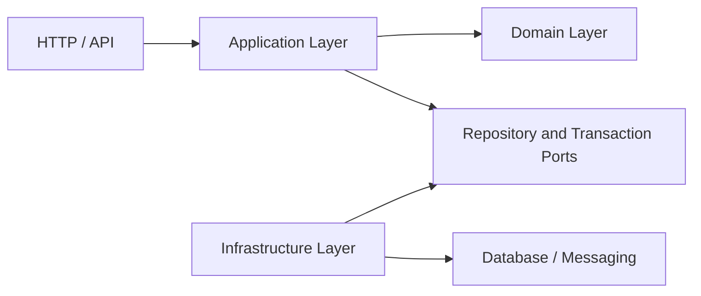

# EPOS Application Layer Architecture

## Purpose

The EPOS Application Layer turns business intentions into coordinated workflows. It receives technology-neutral commands and queries, loads domain objects, invokes domain behavior, persists the resulting state through contracts, and returns stable application results.

It does not decide banking policy. Business rules remain in the Enterprise Domain package.

---

# Dependency Direction



Dependencies point inward:

- The Application Layer depends on the Domain Layer.
- The Domain Layer never depends on the Application Layer.
- Infrastructure implements contracts owned by the Application Layer.
- APIs translate transport requests into application commands and queries.

This keeps domain behavior usable without Express, PostgreSQL, Kafka, or any other delivery or infrastructure technology.

---

# Responsibilities

The Application Layer is responsible for:

- Coordinating one business use case at a time.
- Defining commands, queries, results, and DTOs.
- Loading and saving aggregates through repository interfaces.
- Invoking domain behavior rather than reproducing domain rules.
- Performing application-input validation such as parsing external date strings.
- Defining transaction-boundary contracts.
- Returning application-specific not-found and validation errors.
- Exposing a deliberate public package API.

The Application Layer is not responsible for:

- Domain invariants or lifecycle rules.
- HTTP routing, controllers, or status codes.
- Database queries, schemas, or migrations.
- Messaging brokers or event transport.
- Repository or transaction implementations.
- Dependency-injection and runtime wiring.

---

# Package Structure

```text
packages/enterprise-application/
├── src/
│   ├── shared/
│   │   ├── transactions/
│   │   └── validation/
│   ├── party/
│   ├── customer/
│   ├── product/
│   ├── agreement/
│   ├── account/
│   └── ledger/
└── tests/
    ├── shared/
    ├── party/
    ├── customer/
    ├── product/
    ├── agreement/
    ├── account/
    └── ledger/
```

Each bounded-context directory owns its repository contract, application errors, and vertical use-case slices. A slice groups the command or query, result DTO, handler or use case, and tests for one operation.

---

# Application Contracts

## Commands

A command expresses an intention to change state, such as `OpenAccountCommand`. Command fields are read-only so a workflow cannot accidentally mutate the caller's request object.

## Queries

A query expresses a request to retrieve data without changing domain state, such as `GetCustomerQuery`.

## Results and DTOs

Results are application-owned data-transfer objects. They expose stable primitives rather than leaking mutable domain entities across application boundaries. This allows future APIs to serialize results without coupling transport code to domain internals.

## Use Cases and Query Handlers

Use cases coordinate state-changing workflows. Query handlers coordinate reads. Both remain technology-neutral and receive their dependencies through constructors.

## Repository Interfaces

Repository interfaces describe the persistence operations required by a workflow. They use domain identifiers and aggregates but contain no database code. PostgreSQL implementations belong to Phase 3.

---

# Transaction Boundaries

The shared `TransactionManager` contract defines atomic execution without selecting a database technology. `TransactionalUseCase` decorates a state-changing use case and executes it inside that boundary.

Phase 2 defines and tests the contract. Phase 3 will provide the infrastructure implementation and compose transactional workflows at runtime.

A use case that performs one logical operation should complete fully or leave no partial persistence. An operation that does not write data, such as a query, does not require a transaction merely because it accesses a repository.

---

# Validation Ownership

Validation is assigned according to meaning:

| Validation Type                     | Owner          | Example                          |
| ----------------------------------- | -------------- | -------------------------------- |
| Request shape and transport syntax  | API            | Missing JSON property            |
| Technology-neutral input conversion | Application    | Invalid ISO date string          |
| Business invariant                  | Domain         | Closing an already closed ledger |
| Storage constraint                  | Infrastructure | Unique database index            |

Application validation must not duplicate or weaken domain rules.

---

# Error Model

- `DomainError` represents a violated business rule.
- `ApplicationError` represents a workflow-level failure.
- `ApplicationValidationError` represents invalid application input.
- Context-specific not-found errors represent a requested aggregate that a repository could not locate.

HTTP status codes and transport error bodies are deferred to the service-integration layer.

---

# Implemented Application Scope

| Bounded Context  | Implemented Workflows                                                |
| ---------------- | -------------------------------------------------------------------- |
| Party Management | Register, get, activate, deactivate, change display name             |
| Customer         | Create, get, activate, suspend, close, change segment                |
| Product          | Create, get, approve, make available, suspend, retire, rename        |
| Agreement        | Create, get, submit for acceptance, activate, suspend, expire, close |
| Account          | Open, get, activate, suspend, close                                  |
| Ledger           | Open, get, close                                                     |

The Ledger scope in Release 1 establishes lifecycle orchestration only. Entries, debit and credit postings, balances, reversals, corrections, and reconciliation belong to the Core Banking Platform scope in Release 3.

---

# Public API and Testing

Each context exposes an `index.ts` barrel, and the package root exposes only supported contracts. Package `exports` prevent consumers from relying on internal deep-import paths.

Tests use in-memory fakes to verify orchestration independently of infrastructure. They cover successful workflows, not-found paths, application validation, domain-rule propagation, transaction wrapping, and public error consistency.

---

# Deferred Implementation

The following remain intentionally outside Phase 2:

- PostgreSQL repository implementations and migrations.
- Database-backed transaction management and unit of work.
- REST controllers, HTTP mapping, dependency injection, and OpenAPI.
- Kafka integration and domain-event publication infrastructure.
- Full core-banking ledger posting and balance capabilities.

These are sequenced into later phases and releases without changing the Application Layer boundary defined here.
