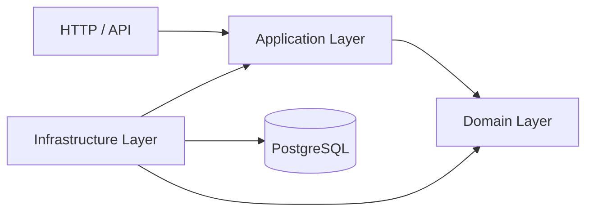

# EPOS Infrastructure Layer Architecture

## Purpose

The EPOS Infrastructure Layer supplies technical implementations for contracts
defined by the Application Layer. Phase 3 introduces PostgreSQL persistence for
the existing Party, Customer, Product, Agreement, Account, and Ledger workflows
without moving business behavior out of the Domain Layer.

This document defines the complete Phase 3 design. Implementation will proceed
only after the relevant design decisions are approved.

---

# Dependency Direction



Allowed dependencies are:

```text
API → Application → Domain
Infrastructure → Application contracts
Infrastructure → Domain objects
```

The Domain and Application packages must not depend on Infrastructure.

---

# First Principles

## Repository Adapter

A repository adapter converts between stored records and domain objects:

```text
PostgreSQL row ⇄ infrastructure mapper ⇄ domain aggregate
```

For example, the database stores an Account as primitive columns such as its
identifier, Agreement identifier, and status. The Application Layer receives an
`Account`, never the database record.

## Transaction

A transaction makes one application workflow atomic. All changes commit
together or all changes roll back. Opening an Account, for example, must not
leave partial persistence if its Agreement lookup succeeds but the Account save
fails.

## Migration

A migration is an ordered, versioned schema change. Applying the same migration
history to an empty database must deterministically produce the schema expected
by the current code.

## Rehydration

Rehydration restores an existing aggregate from persisted state. It does not
create a new business object and does not replay historical lifecycle actions.

---

# Responsibilities

The Infrastructure Layer is responsible for:

- PostgreSQL connection configuration and validation.
- Connection-pool ownership and clean shutdown.
- Versioned database migrations.
- Repository implementations for all six current aggregate contracts.
- Database-row and domain-object mapping.
- Safe aggregate rehydration.
- Atomic transaction execution.
- Infrastructure error classification.
- Real PostgreSQL integration tests.
- Local Docker database support.
- Infrastructure composition factories that do not depend on Express.

The Infrastructure Layer is not responsible for:

- Business rules or lifecycle decisions.
- Application workflow orchestration.
- HTTP controllers, routes, or error responses.
- OpenAPI documentation.
- Kafka or domain-event publication.
- Ledger entries, postings, balances, reversals, or reconciliation.
- Returning database records to inner layers.

---

# Package Structure

```text
packages/enterprise-infrastructure/
├── src/
│   ├── config/
│   ├── database/
│   │   ├── migrations/
│   │   │   └── sql/
│   │   └── transactions/
│   ├── errors/
│   ├── party/
│   ├── customer/
│   ├── product/
│   ├── agreement/
│   ├── account/
│   ├── ledger/
│   └── index.ts
└── tests/
    ├── support/
    ├── database/
    ├── party/
    ├── customer/
    ├── product/
    ├── agreement/
    ├── account/
    └── ledger/
```

Reusable TypeScript adapters belong in `packages/enterprise-infrastructure`.
Operational Docker definitions belong under the repository-level
`infrastructure/` directory.

The package public API will expose supported lifecycle, repository, transaction,
and composition capabilities. Row types, SQL details, and transaction-context
internals will remain private.

---

# PostgreSQL Integration

EPOS will use the `pg` driver with parameterized SQL. The connection pool will
be created explicitly from validated configuration and closed explicitly during
application or test shutdown.

Configuration will support a database URL or individually documented connection
properties. Secrets will not be committed, printed, or included in public error
messages.

Repositories will use:

- The transaction-bound client when called inside `TransactionManager.run()`.
- The shared pool when no transaction is active.

Repository `save()` operations will implement the existing insert-or-update
contract. The precise concurrency behavior will be verified per vertical slice
and must not weaken transaction guarantees.

---

# Initial Relational Model

| Aggregate | Table        | Principal relationships         |
| --------- | ------------ | ------------------------------- |
| Party     | `parties`    | Root identity                   |
| Customer  | `customers`  | References Party                |
| Product   | `products`   | Unique product code             |
| Agreement | `agreements` | References Customer and Product |
| Account   | `accounts`   | References Agreement            |
| Ledger    | `ledgers`    | References Account              |

The schema will use UUID primary keys, non-null constraints, foreign keys,
unique constraints, and checks for the finite values currently modeled by the
domain.

Database constraints protect structural storage integrity. Lifecycle rules such
as whether an Agreement can be activated remain exclusively in the Domain
Layer.

---

# Migration Strategy

Migrations will be:

- Plain SQL.
- Sequentially numbered.
- Immutable after application.
- Forward-only.
- Recorded with checksums.
- Protected against concurrent execution by an advisory lock.
- Transactional when supported by PostgreSQL.
- Invoked explicitly by development, test, CI, and deployment commands.

The migration runner will fail if an already-applied migration has a different
checksum or if the sequence is inconsistent. Importing the Infrastructure
package will never run migrations automatically.

---

# Persistence and Rehydration

Each context will own a private database row type, mapper, and repository
implementation.

Writing follows:

```text
Domain getters → mapper → parameterized SQL → PostgreSQL
```

Reading follows:

```text
PostgreSQL row → validated value objects → aggregate rehydration factory
```

Rehydration factories will restore complete existing state without calling
business transition methods. Invalid stored data will fail loudly as a
persistence error; repositories will not silently repair it.

---

# Transaction Model

`PostgreSqlTransactionManager` will implement the Application Layer's existing
`TransactionManager` contract.

```text
Acquire client
    ↓
BEGIN
    ↓
Bind client to asynchronous transaction context
    ↓
Execute application operation
    ↓
COMMIT on success / ROLLBACK on failure
    ↓
Release client
```

All repositories called inside the operation will share that client. Nested
transaction calls will join the existing transaction. Savepoints are deferred
until a real workflow requires independently recoverable nested work.

Read-only query handlers do not require transactions solely because they use a
repository.

---

# Infrastructure Errors

Infrastructure will expose a small, stable error hierarchy:

- `InfrastructureError`
- `DatabaseConnectionError`
- `PersistenceError`
- `DataIntegrityError`

Driver errors will be translated while preserving their original cause for
diagnostics. Public messages will not expose credentials, SQL parameters, or
raw database records. HTTP mapping remains a Phase 4 responsibility.

---

# Testing Strategy

## Unit Tests

Unit tests will verify configuration parsing, mapping behavior, error
classification, and isolated transaction-context behavior without a database
where practical.

## PostgreSQL Integration Tests

Integration tests will run against a real PostgreSQL instance and verify:

- Migration of an empty database.
- Migration history and checksum behavior.
- Save and find behavior for every repository.
- Round trips for every supported aggregate state.
- Missing-record behavior.
- Updates and relational constraints.
- Successful transaction commits.
- Failure rollbacks.
- Multi-repository atomicity.
- Nested transaction joining.
- Client release after success and failure.
- Rejection of invalid persisted data.

Tests will use isolated test data and deterministic cleanup. Constraints will
not be disabled to simplify tests.

## Local PostgreSQL

Docker Compose will provide a pinned PostgreSQL image, health checks, documented
development and test databases, and persistent development storage. No real
credentials will be committed.

## Continuous Integration

GitHub Actions will start PostgreSQL as a service container, wait for readiness,
apply migrations, and run all workspace formatting, linting, build, unit-test,
and integration-test gates.

---

# Implementation Slices

Phase 3 will be delivered in this order:

1. Architecture decisions and Infrastructure package boundary.
2. Database configuration, pool lifecycle, Docker, and migrations.
3. Party persistence.
4. Customer persistence.
5. Product persistence.
6. Agreement persistence.
7. Account persistence.
8. Ledger lifecycle persistence.
9. Atomic transaction implementation.
10. Infrastructure runtime composition support.
11. CI and architecture documentation completion.
12. Phase 3 exit review.

Each completed slice receives one focused commit after formatting, linting,
building, testing, and diff review pass. Commits are pushed and their GitHub
Actions runs are verified before proceeding.

---

# Exit Criteria

Phase 3 is complete when:

- All six repository contracts have PostgreSQL implementations.
- Every supported aggregate state round-trips correctly.
- Domain and Application packages contain no Infrastructure dependencies.
- Migrations construct the schema deterministically from an empty database.
- Structural constraints are enforced without moving business workflows into
  the database.
- Multi-repository workflows commit or roll back atomically.
- Database clients are released on success and failure.
- Infrastructure errors do not expose sensitive data.
- Docker Compose provides a healthy local PostgreSQL instance.
- Real PostgreSQL integration tests pass locally and in CI.
- All existing tests continue to pass.
- Root formatting, lint, build, test, dependency, and public-export checks pass.
- ADR-0008 and ADR-0009 are accepted.
- Architecture and governance documents match the implementation.
- The Phase 3 Exit Review is approved.

---

# First Implementation Slice

The first slice establishes the governed home for Infrastructure before adding
database behavior. It will add the package skeleton, allowed dependencies,
public-boundary rules, and dependency-direction tests.

In banking terms, this is establishing the controlled vault room and its access
rules before placing customer records inside it.

No PostgreSQL repository or schema implementation belongs in that first slice.

---

# Architectural Decisions

- ADR-0007 owns the Application Layer boundary and repository contracts.
- ADR-0008 selects PostgreSQL, explicit SQL, migrations, and real-database
  verification.
- ADR-0009 defines transaction participation and aggregate rehydration.
