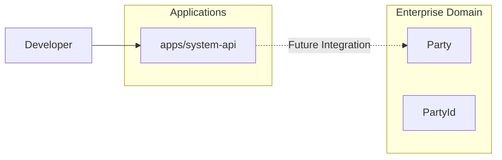
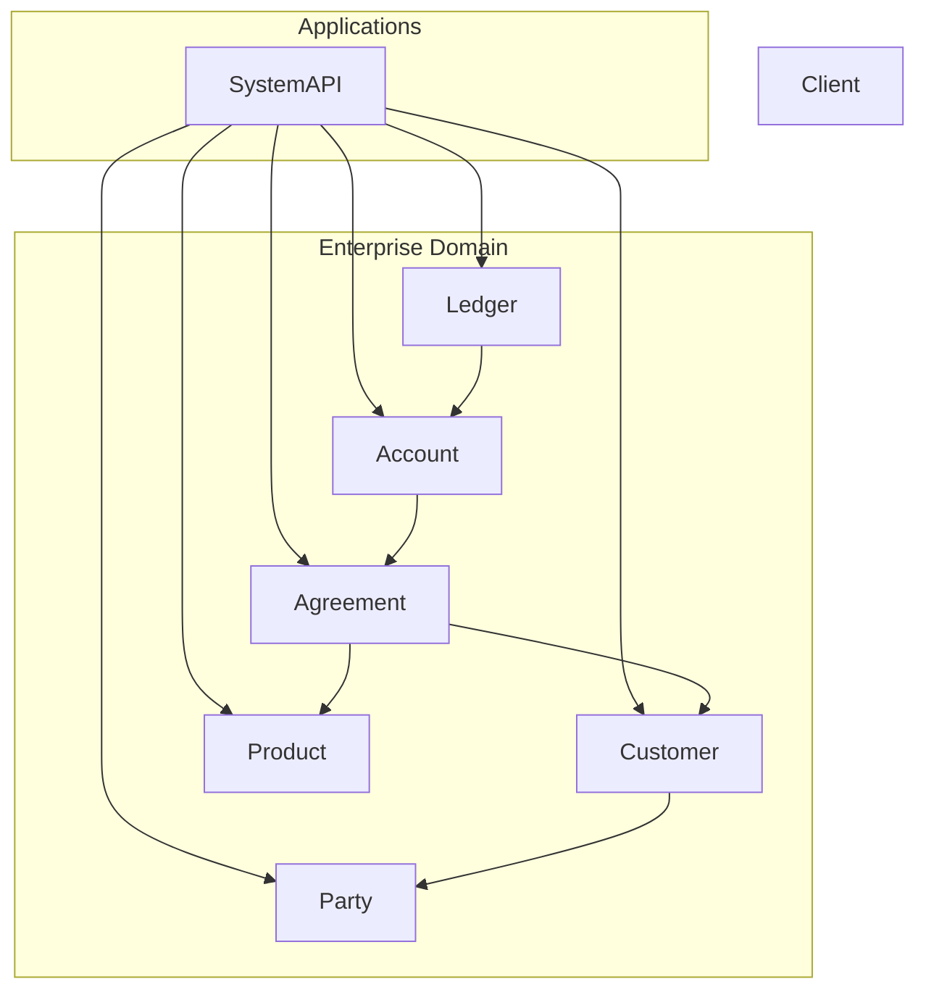
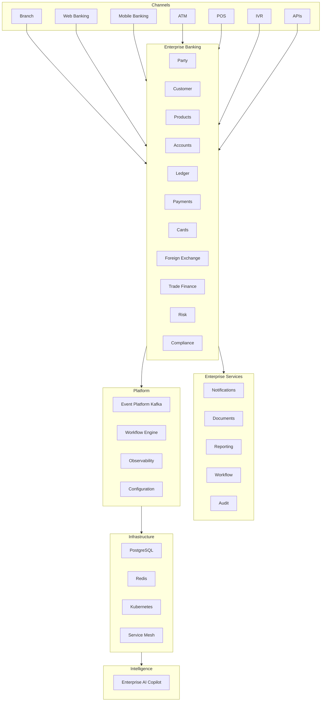

# EPOS Software Architecture

## Purpose

This document provides the architectural evolution of the EPOS platform.

It is maintained throughout the life of the program and illustrates:

- The current production architecture
- The target architecture for the current release
- The long-term target architecture
- Architectural principles adopted
- Architectural patterns introduced
- Key architecture decisions and tradeoffs

---

# Current State Architecture

**Status:** Release 1 – Phase 1

The current implementation provides the engineering foundation and the first enterprise domain package.

### Current Capabilities

- Monorepo (pnpm workspaces)
- System API
- Health endpoints
- Readiness endpoints
- Enterprise Domain package
- Party entity
- PartyId value object
- Build pipeline
- ADR governance
- Program governance

---

# Interim Architecture (After Release 1)

The objective of Release 1 is to establish the enterprise foundation that every future banking capability will build upon.

### Release 1 Deliverables

Enterprise Foundation

- Party
- Customer
- Product
- Agreement
- Account
- Ledger

Engineering Foundation

- Domain-driven architecture
- Clean Architecture
- Repository interfaces
- Factory methods
- Domain events
- Value objects
- Shared Kernel (introduced through refactoring)

Infrastructure

- System API
- Docker
- CI/CD
- Engineering standards
- ADRs

---

# Future State Architecture (Target Release 7)

### Target Capabilities

Enterprise Banking

- Customer Management
- Products
- Accounts
- Ledger
- Payments
- Cards
- Foreign Exchange
- Trade Finance

Enterprise Services

- Notifications
- Documents
- Reporting
- Workflow
- Audit

Platform

- Event Streaming
- Distributed Messaging
- Configuration
- Observability

Infrastructure

- Kubernetes
- PostgreSQL
- Redis
- Service Mesh

Enterprise Intelligence

- AI Copilot
- Operational Intelligence
- Enterprise Analytics

---

# Architecture Evolution

| Release | Architecture Evolution |
|----------|------------------------|
| **1.0** | Enterprise Domain Foundation |
| **2.0** | Core Platform Services |
| **3.0** | Core Banking Services |
| **4.0** | Enterprise Banking Capabilities |
| **5.0** | Distributed Platform |
| **6.0** | Platform Engineering & Reliability |
| **7.0** | Enterprise Intelligence & Unified Operations |

---

# Architecture Principles

- Domain-Driven Design
- Business-first modelling
- Clean Architecture
- Infrastructure independence
- Separation of concerns
- API-first integration
- Modular monorepo
- Incremental architecture evolution
- Contract-first design
- Single source of truth

---

# Architecture Patterns

| Pattern | First Introduced | Status |
|----------|------------------|--------|
| Entity | Release 1 | ✅ |
| Value Object | Release 1 | ✅ |
| Factory Method | Release 1 | Planned |
| Repository Pattern | Release 1 | Planned |
| Domain Events | Release 1 | Planned |
| Aggregate Root | Release 1 | Planned |
| Shared Kernel | Release 1 | Planned |
| Transaction Boundary | Release 4 | Planned |
| Unit of Work | Release 4 | Planned |
| Idempotency | Release 4 | Planned |
| Outbox Pattern | Release 4 | Planned |
| Event Streaming | Release 5 | Planned |
| Saga Pattern | Release 5 | Planned |
| Retry Pattern | Release 5 | Planned |
| Dead Letter Queue | Release 5 | Planned |
| CQRS | Release 5 | Planned |
| Event Sourcing | Release 5 | Planned |
| Circuit Breaker | Release 6 | Planned |
| Bulkhead | Release 6 | Planned |
| Service Mesh | Release 6 | Planned |
| AI Copilot | Release 7 | Planned |

---

# Architecture Tradeoffs

| Decision | Benefit | Tradeoff |
|----------|---------|----------|
| Monorepo | Simplified dependency management | Larger repository |
| Business-first modelling | Stable enterprise model | Slower initial development |
| Domain-first implementation | Independent business logic | More upfront design |
| Shared Kernel introduced through refactoring | Simpler learning path | Later abstraction |
| API-first integration | Loose coupling | Additional interface management |
| Event-driven architecture | Scalability and resilience | Eventual consistency |
| Outbox Pattern | Reliable event publication | Additional infrastructure components |
| Repository Pattern | Database independence | Extra abstraction layer |

---

## Migration-Aware Architecture Principles

EPOS is designed to support incremental enterprise modernization rather than one-time replacement.

Although migration infrastructure is introduced in later releases, all application and domain code should be developed with future migration, rollback, and coexistence in mind.

| Principle | Design Guideline | Introduced |
|-----------|------------------|------------|
| Business-first Domain | Domain model remains independent of migration and infrastructure concerns. | Release 1 |
| Infrastructure Independence | Domain layer shall not depend on databases, messaging platforms, or external systems. | Release 1 |
| Stable Business Identity | Business entities use immutable identifiers to support coexistence and migration between legacy and modern platforms. | Release 1 |
| Explicit Business State | Entity lifecycle is represented through explicit business states rather than implicit logic to enable controlled rollback. | Release 1 |
| Repository Abstraction | Persistence is accessed through repository interfaces, allowing multiple storage implementations during migration. | Release 1 |
| Application Orchestration | Transaction boundaries, migration logic, and infrastructure orchestration belong in the Application Layer rather than the Domain Layer. | Release 2 |
| Feature-driven Deployment | New capabilities should support progressive enablement through configuration or feature flags. | Release 4 |
| Migration Routing | Requests should be capable of being routed to legacy or modern implementations based on configurable migration rules. | Release 4 |
| Idempotent Processing | Operations that may be retried or replayed must support idempotent execution. | Release 4 |
| Reliable Event Publication | Database updates and event publication shall support transactional consistency through the Outbox Pattern. | Release 4 |
| Parallel Processing Support | High-risk capabilities should support legacy and modern systems operating concurrently during migration. | Release 4 |
| Event-driven Integration | Cross-domain communication should transition from synchronous integration to asynchronous event-driven messaging where appropriate. | Release 5 |
| Distributed Reliability | Enterprise messaging shall support retries, dead-letter queues, replay, and eventual consistency. | Release 5 |
| Reversible Deployment | Production deployments should support controlled rollback through deployment and routing strategies without requiring domain model changes. | Release 5 |

---

### Design Philosophy

The EPOS architecture follows a migration-aware design philosophy:

- Business capabilities are implemented independently of migration strategies.
- Infrastructure concerns remain outside the Domain Layer.
- Migration, rollback, routing, and coexistence are implemented through the Application and Infrastructure layers.
- Architectural decisions made in early releases should minimize refactoring as the platform evolves.
- New enterprise capabilities should integrate with existing migration patterns rather than introducing bespoke migration logic.

---

### Guiding Principle

> **Design the platform so that migration is an operational concern, not a domain concern.**

Business logic should remain stable regardless of whether the platform is operating in pilot, phased migration, parallel run, or full production mode.

# Revision History

| Version | Release | Description |
|----------|---------|-------------|
| 1.0 | Release 1 | Initial enterprise architecture baseline |